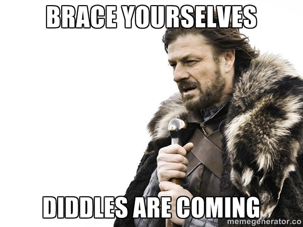

<!-- #TODO: move to an external stylesheet -->

## Triplet Diddle vs. Game of Thrones
This triplet diddle arrangement provides an opportunity for battery to combine with the
front&nbsp;ensemble.

<iframe width="560" height="315" src="https://www.youtube.com/embed/l63i0jZdKvw?rel=0"
        frameborder="0" allowfullscreen>
</iframe>
 

The University of Dayton Arena is the venue for the annual
WGI&nbsp;Percussion&nbsp;Championships.

To make this video, I converted a 3D model from the SketchUp Warehouse to a
Collada&nbsp;.dae&nbsp;file.

Then, I manipulated the zoom and rotation in Apple's Quartz Composer
visual&nbsp;programming&nbsp;environment.

 

